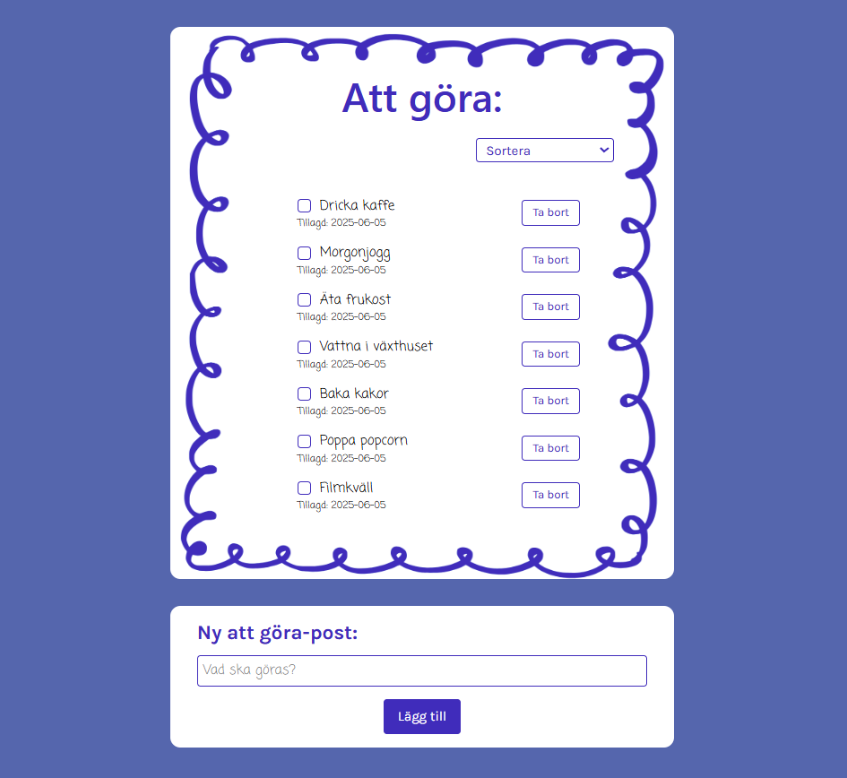

# Assignment - The Last Todos

## 🚀 Project Overview 
This project is a Todo List application built as part of an assignment to practice component-based architecture, state management, and styling using Tailwind CSS.

### 📝 Assignment Requirements & Criteria
This project was developed based on a course assignment with separate requirements for passing (G) and higher grade (VG).

#### Requirements for Grade G:
- Create a hardcoded list of todos (with more than just plain text)
- Display the list on screen 
- Allow marking a todo as done
- Update the JavaScript list when a todo is completed
- Implement a click handler to remove a todo
- Persist data using localStorage
- Use at least one component
- Use state with a list of objects

#### Requirements for Grade VG (in addition to above):
- Allow toggling todos back from done to undone
- Add a form to create new todos
- Allow sorting of the list by different criteria
- Implement a UI framework (Tailwind CSS was chosen here)
- Use at least three components
- Use Lifting State Up to manage shared state between components

### 🪄 What I Built
Users can view existing todos, add new ones, mark them as completed or uncompleted, delete them, and sort the list in different ways. The app is fully responsive and adapts well to different screen sizes. The visual design is intentionally minimalistic and clean, using playful fonts to resemble a handwritten to-do list.

## 🎥 Demo 
[Click here to view the demo](https://medieinstitutet.github.io/fed24d-the-last-todos-oliviaalmseger/)

## 📸 Screenshots
**Whole page**

**Sorting**

## 💻 Tech Stack 

## ✍️ Author 
Created by: 
- [Olivia Almseger ](https://github.com/oliviaalmseger) 	

## 🤝 Credits
This project was developed as part of the curriculum at [Medieinstitutet](https://medieinstitutet.se/) during our first year of studies.
